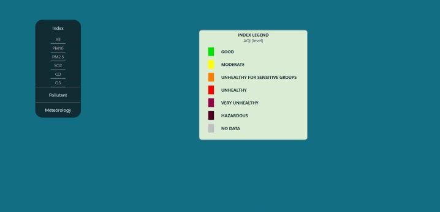

# Display data from json file

👍 This app developed with: React JS. \
👍 This app displays data from the json file \
👍 I developed it dynamically as possible \
👍 You can add objects to the json file and see the changes immediately on the screen \
👍 The app is responsive, resize the browser window to see the responsive effect 




### Setup & Run
- Clone or download this repository https://github.com/sharonNissanov/legends-api
- Install dependencies: in cmd run ```npm install``` 
- Run the app in the development mode: in cmd run ```npm start```\
Open [http://localhost:3000](http://localhost:3000) to view it in the browser.\
The page will reload if you make edits.\
You will also see any lint errors in the console. 

Enjoy 😊
